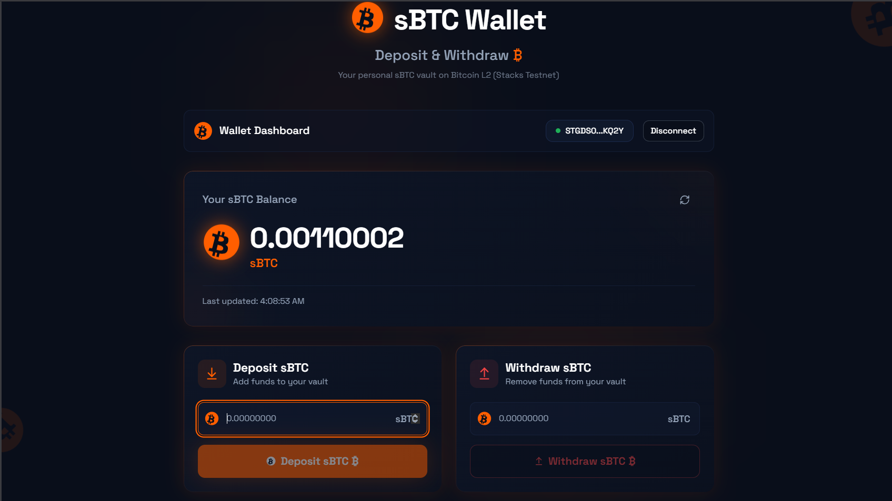
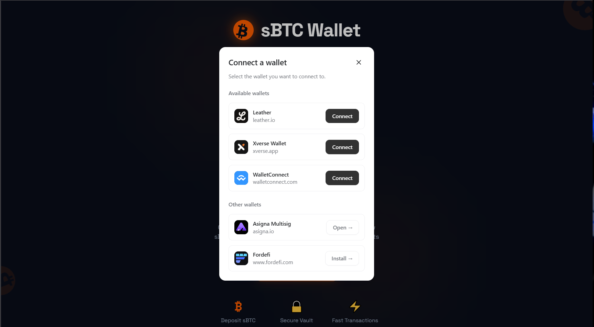
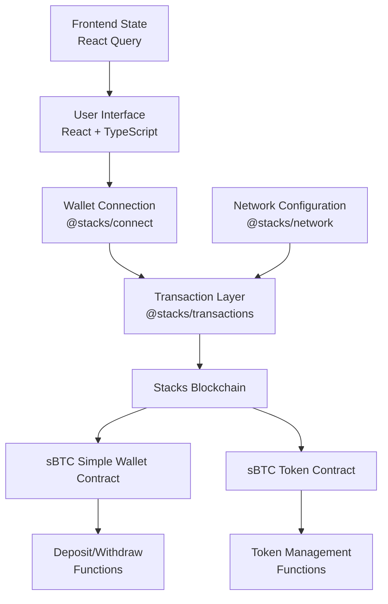
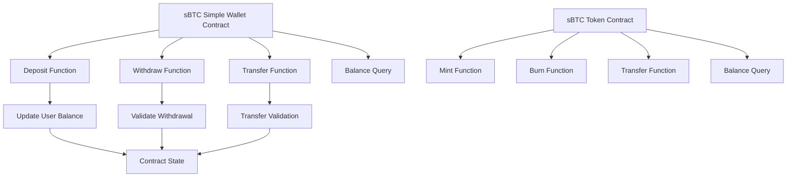
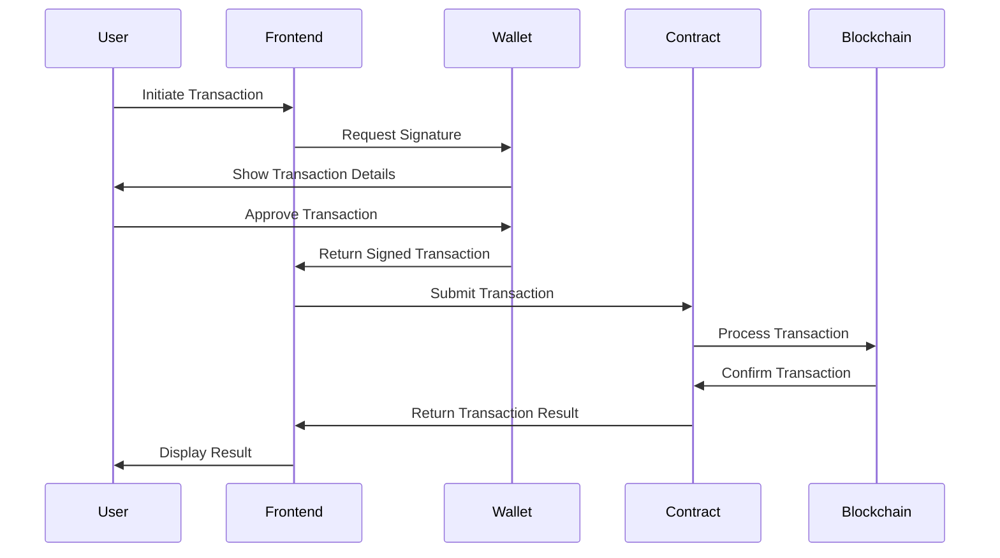

# sBTC Simple Wallet

[](https://nodejs.org/)
[](https://reactjs.org/)
[](https://www.typescriptlang.org/)
[](https://vitejs.dev/)
[](https://clarity-lang.org/)
[](https://stacks.co/)
[](https://opensource.org/licenses/MIT)



A decentralized wallet application for managing sBTC (Stacks Bitcoin) built on the Stacks blockchain using Clarity smart contracts. This project provides a secure, user-friendly interface for interacting with Bitcoin-backed assets on the Stacks ecosystem.

## Table of Contents

- [Overview](#overview)
- [Architecture](#architecture)
- [How It Works](#how-it-works)
- [Features](#features)
- [Prerequisites](#prerequisites)
- [Installation](#installation)
- [Development](#development)
- [Testing](#testing)
- [Deployment](#deployment)
- [Project Structure](#project-structure)
- [API Reference](#api-reference)
- [Contributing](#contributing)
- [Security](#security)
- [License](#license)
- [Resources](#resources)

## Overview

The sBTC Simple Wallet is a full-stack decentralized application that enables users to manage their sBTC tokens through an intuitive web interface. The application consists of:

- **Smart Contracts**: Clarity-based contracts deployed on the Stacks blockchain
- **Frontend Application**: React-based user interface built with modern web technologies
- **Integration Layer**: Seamless connection between frontend and blockchain contracts

The project demonstrates best practices for DeFi application development on the Stacks ecosystem, including secure wallet connections, transaction management, and real-time blockchain state updates.



## Architecture

### System Architecture



### Contract Architecture



### Data Flow



## How It Works

### Core Functionality

1. **Wallet Connection**: Users connect their Stacks-compatible wallets (e.g., Hiro Wallet, Xverse) to the application
2. **sBTC Management**: The application interacts with sBTC tokens through the deployed smart contracts
3. **Transaction Processing**: All operations are processed as blockchain transactions requiring user signatures
4. **State Synchronization**: Real-time updates of balances and transaction history from the blockchain

### Smart Contract Interaction

The frontend communicates with the Stacks blockchain through the following flow:

1. **Contract Calls**: Read operations query contract state without requiring transactions
2. **Transaction Submission**: Write operations create and submit transactions to the network
3. **Event Monitoring**: The application monitors blockchain events for transaction confirmations
4. **State Updates**: UI state is updated based on blockchain confirmations

### Security Model

- **Non-custodial**: Users maintain full control of their private keys and assets
- **Transaction Signing**: All operations require explicit user approval
- **Contract Verification**: Smart contracts are deployed with source code verification
- **Audit Trail**: All transactions are recorded immutably on the blockchain

## Features

### Core Features

- **Secure Wallet Integration**: Connect with popular Stacks wallets
- **sBTC Balance Management**: View and track sBTC token balances
- **Deposit Functionality**: Deposit sBTC tokens into the wallet contract
- **Withdrawal Operations**: Secure withdrawal of sBTC tokens
- **Transfer Capabilities**: Send sBTC tokens to other addresses
- **Transaction History**: Complete history of all wallet operations

### Technical Features

- **Real-time Updates**: Live balance and transaction status updates
- **Responsive Design**: Mobile-first design with modern UI components
- **Type Safety**: Full TypeScript implementation for reliability
- **Error Handling**: Comprehensive error handling and user feedback
- **Network Support**: Support for mainnet, testnet, and devnet environments

## Prerequisites

### System Requirements

- **Node.js**: Version 18.0.0 or higher
- **npm**: Version 8.0.0 or higher (comes with Node.js)
- **Git**: Version 2.30.0 or higher

### Development Tools

- **Clarinet**: Stacks smart contract development toolkit
- **Stacks Wallet**: Hiro Wallet, Xverse, or compatible wallet
- **Code Editor**: VS Code recommended with Clarity and TypeScript extensions

### Network Access

- **Internet Connection**: Required for blockchain interactions
- **Stacks API**: Access to Stacks blockchain nodes
- **Test BTC**: For testing on testnet (faucet available)

## Installation

### Clone Repository

```bash
git clone https://github.com/your-username/sbtc-simple-wallet.git
cd sbtc-simple-wallet
```

### Install Dependencies

```bash
# Install frontend dependencies
npm install

# Install contract dependencies
cd clarity-contract
npm install
cd ..
```

### Environment Setup

1. **Configure Networks**: Update network configurations in `clarity-contract/settings/`
2. **Wallet Setup**: Install and configure a Stacks-compatible wallet
3. **Testnet Access**: Obtain test BTC from the Stacks testnet faucet

## Development

### Frontend Development

```bash
# Start development server
npm run dev

# Build for production
npm run build

# Preview production build
npm run preview

# Run linting
npm run lint
```

### Contract Development

```bash
cd clarity-contract

# Run contract tests
npm test

# Start local development network
clarinet integrate

# Deploy to testnet
clarinet deployments apply -p deployments/default.testnet-plan.yaml
```

### Development Workflow

1. **Local Development**: Use `clarinet integrate` for local blockchain testing
2. **Contract Testing**: Write and run comprehensive test suites
3. **Frontend Integration**: Connect frontend to local contract deployments
4. **End-to-End Testing**: Test complete user flows

## Testing

### Contract Testing

```bash
cd clarity-contract

# Run all tests
npm test

# Run tests in watch mode
npm run test:watch

# Run specific test file
npm test sbtc-simple-wallet.test.ts
```

### Frontend Testing

```bash
# Run frontend tests (when implemented)
npm test

# Run E2E tests (when implemented)
npm run test:e2e
```

### Test Coverage

- **Unit Tests**: Individual function and component testing
- **Integration Tests**: Contract-frontend interaction testing
- **End-to-End Tests**: Complete user journey testing

## Deployment

### Contract Deployment

#### Testnet Deployment

```bash
cd clarity-contract

# Deploy to testnet
clarinet deployments apply -p deployments/default.testnet-plan.yaml

# Verify deployment
clarinet deployments check
```

#### Mainnet Deployment

```bash
cd clarity-contract

# Deploy to mainnet (use mainnet settings)
clarinet deployments apply -p deployments/default.mainnet-plan.yaml
```

### Frontend Deployment

#### Build Process

```bash
# Build optimized production bundle
npm run build

# Deploy to hosting platform (Vercel, Netlify, etc.)
# Follow platform-specific deployment instructions
```

#### Environment Configuration

- **Contract Addresses**: Update deployed contract addresses in frontend config
- **Network Settings**: Configure appropriate network endpoints
- **API Keys**: Set up any required API keys for external services

## Project Structure

```
sbtc-simple-wallet/
├── clarity-contract/          # Smart contract layer
│   ├── contracts/            # Clarity smart contracts
│   │   ├── sbtc-simple-wallet.clar
│   │   └── sbtc-token.clar
│   ├── tests/               # Contract test suites
│   ├── deployments/         # Network deployment configs
│   ├── settings/            # Network configurations
│   └── package.json         # Contract dependencies
├── src/                     # Frontend application
│   ├── components/          # Reusable UI components
│   ├── pages/              # Application pages
│   ├── hooks/              # Custom React hooks
│   ├── lib/                # Utility functions
│   └── App.tsx             # Main application component
├── public/                  # Static assets
├── package.json            # Frontend dependencies
├── vite.config.ts          # Build configuration
├── tailwind.config.ts      # Styling configuration
└── tsconfig.json           # TypeScript configuration
```

## API Reference

### Smart Contract Functions

#### sBTC Simple Wallet Contract

- `deposit(amount: uint)` - Deposit sBTC tokens into wallet
- `withdraw(amount: uint)` - Withdraw sBTC tokens from wallet
- `transfer(recipient: principal, amount: uint)` - Transfer sBTC to another address
- `get-balance(user: principal)` - Query user balance

#### sBTC Token Contract

- `mint(recipient: principal, amount: uint)` - Mint new sBTC tokens
- `burn(amount: uint)` - Burn sBTC tokens
- `transfer(recipient: principal, amount: uint)` - Transfer tokens
- `balance-of(owner: principal)` - Query token balance

### Frontend Components

- `WalletConnect` - Wallet connection interface
- `BalanceDisplay` - Token balance display
- `TransactionForm` - Transaction input forms
- `TransactionHistory` - Transaction history viewer

## Contributing

We welcome contributions from the community. Please follow these guidelines:

### Development Process

1. **Fork** the repository
2. **Create** a feature branch (`git checkout -b feature/amazing-feature`)
3. **Commit** your changes (`git commit -m 'Add amazing feature'`)
4. **Push** to the branch (`git push origin feature/amazing-feature`)
5. **Open** a Pull Request

### Code Standards

- **TypeScript**: Strict type checking enabled
- **ESLint**: Code linting and formatting
- **Prettier**: Consistent code formatting
- **Testing**: Comprehensive test coverage required

### Commit Convention

```
type(scope): description

Types:
- feat: New feature
- fix: Bug fix
- docs: Documentation
- style: Code style changes
- refactor: Code refactoring
- test: Testing
- chore: Maintenance
```

### Pull Request Process

1. **Update** the README.md with details of changes
2. **Update** the version numbers in package.json
3. **Test** all changes thoroughly
4. **Ensure** CI/CD checks pass
5. **Request** review from maintainers

## Security

### Security Considerations

- **Private Key Security**: Never store private keys in the application
- **Transaction Validation**: All transactions require user confirmation
- **Contract Audits**: Smart contracts should be audited before mainnet deployment
- **Dependency Updates**: Regularly update dependencies for security patches

### Reporting Security Issues

Please report security vulnerabilities by emailing security@yourproject.com or opening a private issue.

## License

This project is licensed under the MIT License - see the [LICENSE](LICENSE) file for details.

## Resources

### Documentation

- [Stacks Documentation](https://docs.stacks.co/)
- [Clarity Language Reference](https://docs.stacks.co/clarity/)
- [Clarinet Documentation](https://github.com/hirosystems/clarinet)
- [sBTC Documentation](https://docs.stacks.co/sbtc/)

### Community

- [Stacks Forum](https://forum.stacks.org/)
- [Discord Community](https://discord.gg/stacks)
- [GitHub Discussions](https://github.com/your-username/sbtc-simple-wallet/discussions)

### Development Tools

- [Hiro Wallet](https://wallet.hiro.so/)
- [Stacks Explorer](https://explorer.stacks.co/)
- [Clarinet VS Code Extension](https://marketplace.visualstudio.com/items?itemName=hirosystems.clarinet)

---

**Built with ❤️ on the Stacks blockchain**
