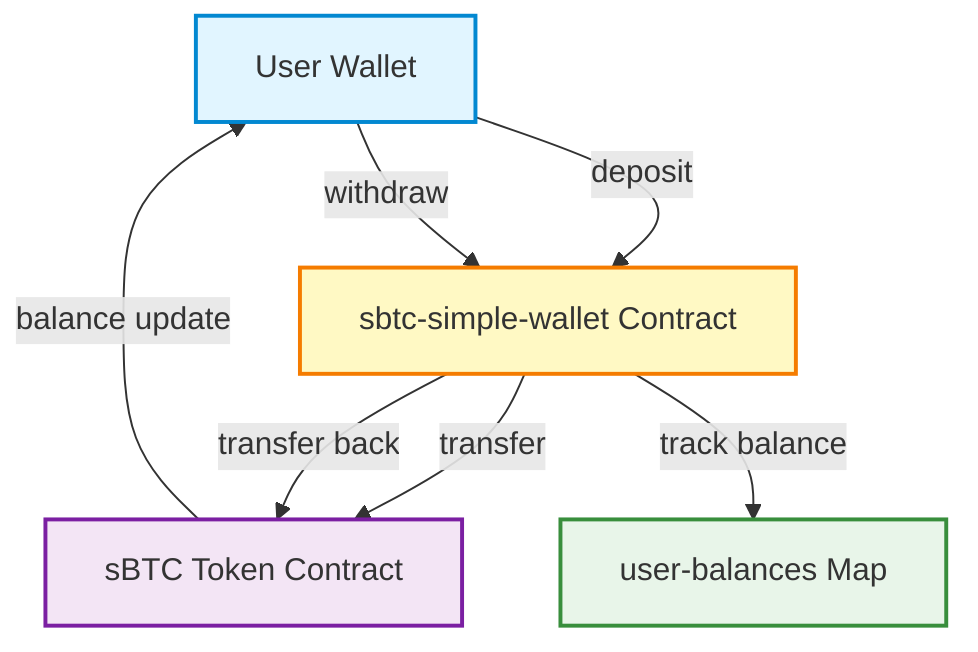
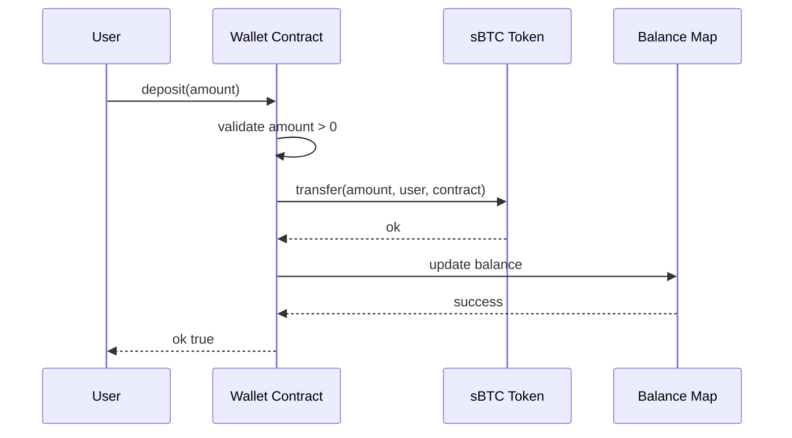
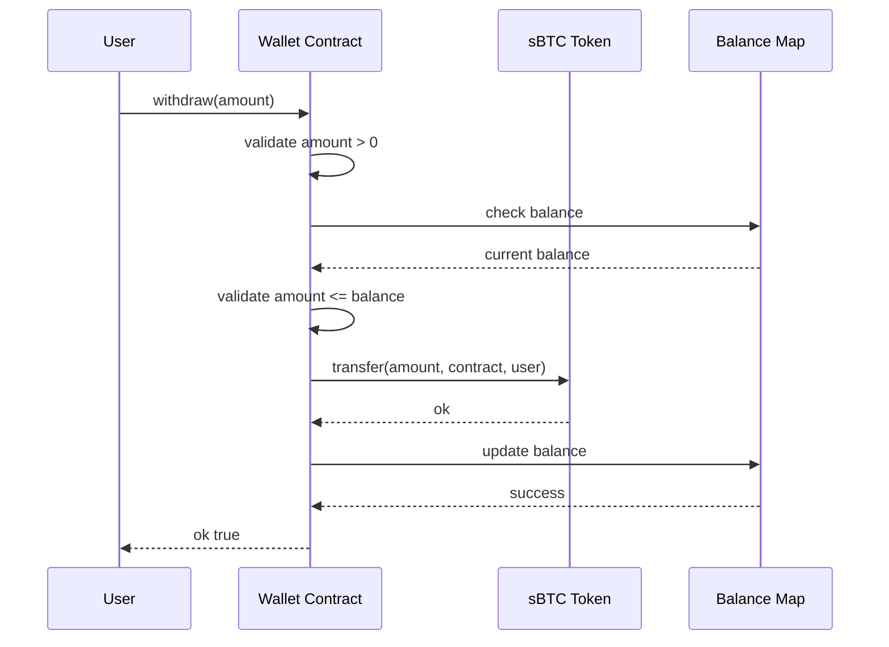
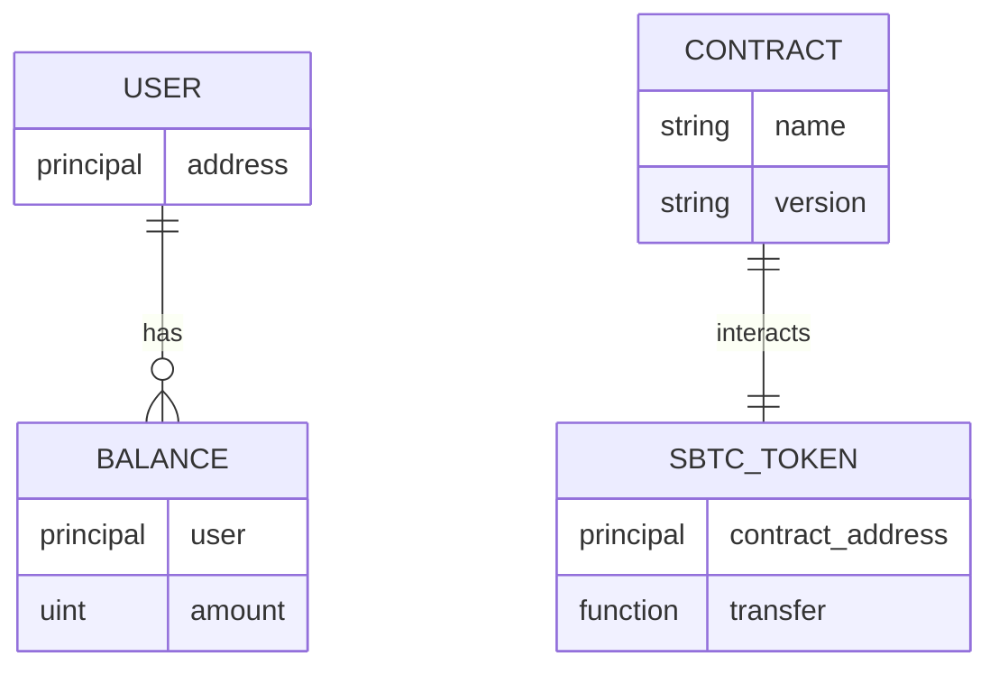

# sBTC Simple Wallet

[](https://docs.stacks.co/clarity)
[](https://explorer.stacks.co/?chain=testnet)
[](LICENSE)
[](https://github.com)

A lightweight, gas-efficient Clarity smart contract for managing sBTC deposits and withdrawals on the Stacks blockchain. Designed for high-throughput sBTC transfer operations with minimal overhead.

## Table of Contents

- [Overview](#overview)
- [Features](#features)
- [Architecture](#architecture)
- [Contract Details](#contract-details)
- [Installation](#installation)
- [Usage](#usage)
- [Testing](#testing)
- [Deployment](#deployment)
- [API Reference](#api-reference)
- [Security Considerations](#security-considerations)
- [Contributing](#contributing)
- [License](#license)

## Overview

The sBTC Simple Wallet is a minimalist smart contract implementation that enables users to deposit and withdraw sBTC (Stacks-wrapped Bitcoin) on the Stacks blockchain. The contract maintains individual balance tracking for each user while leveraging the native sBTC token standard for secure transfer operations.

**Deployed Contract**: `STGDS0Y17973EN5TCHNHGJJ9B31XWQ5YXBQ0KQ2Y.sbtc-simple-wallet`

## Features

- **Deposit sBTC**: Users can deposit any amount of sBTC to the contract
- **Withdraw sBTC**: Users can withdraw up to their available balance
- **Balance Tracking**: Individual balance management per user principal
- **Gas Optimized**: Minimal storage and computation overhead
- **Security**: Built-in validation and error handling
- **Clarity 2 Compatible**: Uses modern Clarity features including `as-contract`

## Architecture

### System Architecture



### Deposit Flow



### Withdraw Flow



### Data Model



## Contract Details

### Constants

- **sbtc-token**: `'STGDS0Y17973EN5TCHNHGJJ9B31XWQ5YXBQ0KQ2Y.sbtc-token'` - Reference to the deployed sBTC token contract

### Data Structures

- **user-balances**: `(define-map user-balances principal uint)` - Maps user principals to their sBTC balances

### Error Codes

| Code | Description |
|------|-------------|
| `u1` | Invalid deposit amount (amount must be > 0) |
| `u2` | Invalid withdraw amount (amount must be > 0) |
| `u3` | Insufficient balance for withdrawal |

## Installation

### Prerequisites

- [Clarinet](https://github.com/hirosystems/clarinet) v3.11.0+
- Node.js v18+ (for testing)
- Stacks wallet with testnet STX

### Clone and Setup

```bash
git clone <repository-url>
cd clarity-contract
npm install
```

### Verify Installation

```bash
clarinet check
```

Expected output:
```
✔ 1 contract checked
```

## Usage

### Deposit sBTC

```clarity
(contract-call? .sbtc-simple-wallet deposit u1000000)
```

### Withdraw sBTC

```clarity
(contract-call? .sbtc-simple-wallet withdraw u500000)
```

### Check Balance

```clarity
(contract-call? .sbtc-simple-wallet get-balance tx-sender)
```

## Testing

### Run Local Tests

```bash
npm test
```

### Run in Clarinet Console

```bash
clarinet console
```

Example test commands:
```clarity
;; Deploy contracts
::deploy

;; Check initial balance
(contract-call? .sbtc-simple-wallet get-balance tx-sender)

;; Make a deposit
(contract-call? .sbtc-simple-wallet deposit u1000000)

;; Verify balance
(contract-call? .sbtc-simple-wallet get-balance tx-sender)

;; Withdraw funds
(contract-call? .sbtc-simple-wallet withdraw u500000)
```

## Deployment

### Generate Deployment Plan

```bash
clarinet deployments generate --testnet --medium-cost
```

### Deploy to Testnet

```bash
clarinet deployments apply --testnet
```

### Verify Deployment

Check the transaction on [Stacks Explorer](https://explorer.stacks.co/?chain=testnet)

## API Reference

### Public Functions

#### deposit

Deposit sBTC tokens to the contract.

**Signature**: `(define-public (deposit (amount uint)))`

**Parameters**:
- `amount` (uint): Amount of sBTC to deposit (must be > 0)

**Returns**: `(response bool uint)`
- Success: `(ok true)`
- Error: `(err u1)` if amount is 0

**Example**:
```clarity
(contract-call? .sbtc-simple-wallet deposit u1000000)
```

#### withdraw

Withdraw sBTC tokens from the contract.

**Signature**: `(define-public (withdraw (amount uint)))`

**Parameters**:
- `amount` (uint): Amount of sBTC to withdraw (must be > 0 and <= balance)

**Returns**: `(response bool uint)`
- Success: `(ok true)`
- Error: `(err u2)` if amount is 0
- Error: `(err u3)` if insufficient balance

**Example**:
```clarity
(contract-call? .sbtc-simple-wallet withdraw u500000)
```

### Read-Only Functions

#### get-balance

Get the sBTC balance for a specific user.

**Signature**: `(define-read-only (get-balance (user principal)))`

**Parameters**:
- `user` (principal): The user's principal address

**Returns**: `uint` - The user's balance (0 if no deposits made)

**Example**:
```clarity
(contract-call? .sbtc-simple-wallet get-balance 'ST1PQHQKV0RJXZFY1DGX8MNSNYVE3VGZJSRTPGZGM)
```

## Security Considerations

### Audit Status

This contract has not been formally audited. Use at your own risk.

### Known Limitations

1. **No Access Control**: Any user can deposit/withdraw their own funds (intended behavior)
2. **No Emergency Stop**: Contract does not include pause functionality
3. **Dependency on External Contract**: Relies on the sBTC token contract being available and functioning correctly
4. **No Fee Mechanism**: Contract does not charge fees for operations

### Best Practices

- Always verify the sBTC token contract address before depositing
- Test with small amounts first
- Keep track of your deposits and withdrawals
- Monitor gas costs for operations

### Security Features

- Input validation on all public functions
- Balance checks before withdrawals
- Use of `try!` for error propagation
- Immutable contract constants

## Contributing

Contributions are welcome! Please follow these guidelines:

1. Fork the repository
2. Create a feature branch (`git checkout -b feature/amazing-feature`)
3. Commit your changes (`git commit -m 'Add amazing feature'`)
4. Push to the branch (`git push origin feature/amazing-feature`)
5. Open a Pull Request

### Development Guidelines

- Follow Clarity best practices
- Add tests for new features
- Update documentation
- Maintain backward compatibility

## License

This project is licensed under the MIT License - see the [LICENSE](LICENSE) file for details.

---

**Built with**:
- [Clarity](https://docs.stacks.co/clarity) - Smart contract language
- [Stacks](https://www.stacks.co/) - Bitcoin L2 blockchain
- [Clarinet](https://github.com/hirosystems/clarinet) - Development framework

**Maintained by**: Blockchain Development Team

**Version**: 1.0.0
